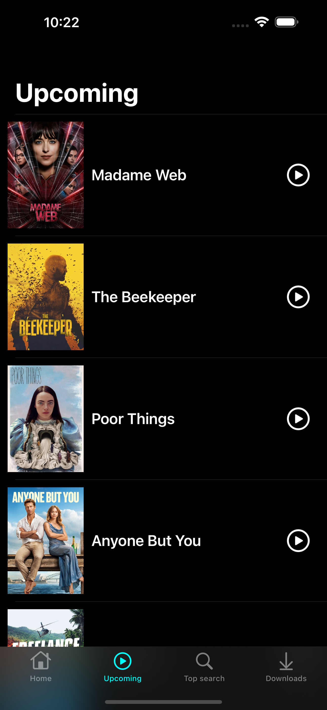
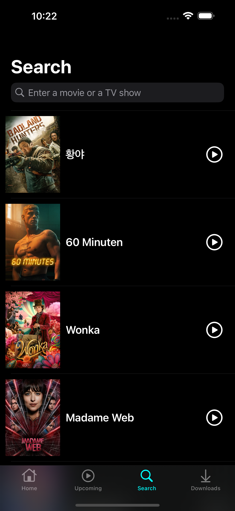

# TheMovie
TheMovie is a peronal iOS app developed from scratch using **Swift**, **UIkit**, **Swift Pakage Manager** and implement data from **The Movie Database** APIs by using **Alamofire**. I also integrate **Google Cloud API**. This app is structured as **MVVM**.

For more information about the APIs, please visit [The Movie DB](https://developer.themoviedb.org/docs/getting-started)

## App in general 
Currently, this app begin at Home screen, and other screens are still being developed. Below are some basic screens that have been done.

**Home screen and Upcoming screen**

 

**Search and Search Result**

 

## Installation
Just clone this repository, wait a bit for all the packages resolved and run it.
